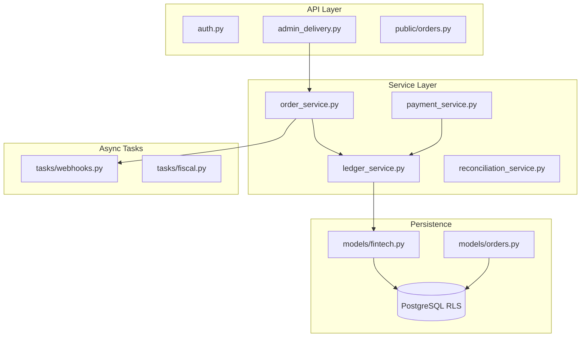

# 🗺️ Mapa de Dependências e Integrações Externas
**Versão:** 5.0.1-SEQ | **Domínio:** INFRASTRUCTURE

## 1. Diagrama de Dependências Internas

## 2. Catálogo de Integrações Externas

| Provedor | Endpoint | Função | Timeout | Fallback |
| :--- | :--- | :--- | :---: | :--- |
| **Mercado Pago** | `/v1/payments` | Pix/Cartão | 10s | Pix Estático (Manual) |
| **Stripe** | `/v1/checkout` | SaaS Billing | 15s | Grace Period (3 dias) |
| **FocusNFe** | `/v2/nfce` | Fiscal | 30s | Contingência Offline (Dexie) |
| **Evolution API** | `/message/send` | WhatsApp | 5s | Log Silencioso (Fail-Open) |

### 2.1. Resiliência de Integração
- **Circuit Breaker:** Ativo para FocusNFe e Mercado Pago. Se 20 erros ocorrerem em 60s, o circuito abre por 30s.
- **Idempotência:** Chave `X-Idempotency-Key` enviada em todos os POSTs externos.

