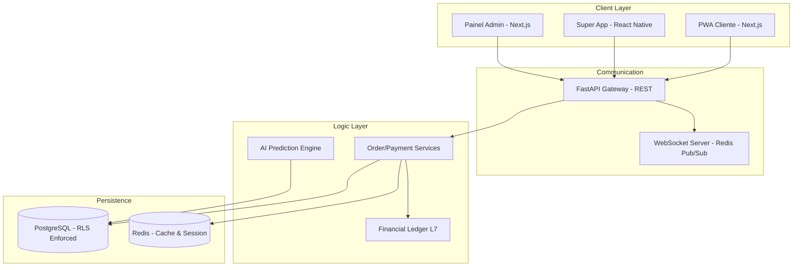

# 🗺️ Mapa de Arquitetura MesaFlow OS

## Pontos de Integração Externa
- **Mercado Pago:** Pix e Split de Pagamento.
- **Stripe:** SaaS Billing e Assinaturas.
- **FocusNFe:** Emissão de documentos fiscais.
- **Evolution API:** Notificações transacionais WhatsApp.

