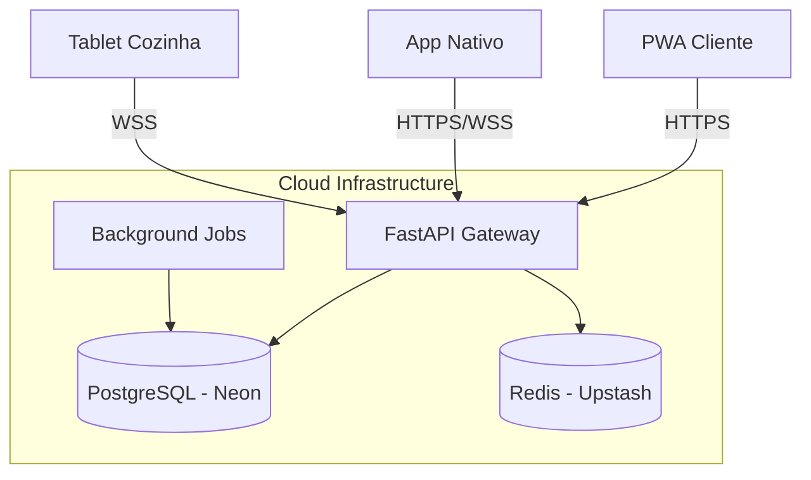

# 🏗️ Visão Geral da Arquitetura

## 1. Diagrama Lógico
O MesaFlow opera sob uma arquitetura de **Monolito Modular Híbrido**, otimizada para consistência de dados e baixa latência operacional.

## 2. Componentes Principais

### 2.1 Backend (Core)
- **Tecnologia:** Python 3.11+ / FastAPI.
- **Responsabilidade:** Regras de negócio, orquestração de pedidos, integrações financeiras.
- **Execução:** Containers Docker stateless escaláveis horizontalmente.

### 2.2 Frontend (Web)
- **Tecnologia:** Next.js 14 (React).
- **Responsabilidade:** Cardápio digital, Painel Administrativo, KDS Web.
- **Distribuição:** Edge Network (CDN) para alta performance global.

### 2.3 Mobile (Operação)
- **Tecnologia:** React Native (Expo SDK 54).
- **Responsabilidade:** Ponto de Venda (POS) móvel, gestão de mesas, notificações push.
- **Arquitetura:** Offline-first com sincronização eventual.

## 3. Estratégia de Dados

### 3.1 Persistência
- **Banco Relacional:** PostgreSQL para dados transacionais (ACID).
- **Connection Pooling:** PgBouncer para gestão eficiente de conexões em escala.

### 3.2 Real-time
- **Pub/Sub:** Redis utilizado como broker de mensagens para sincronizar eventos (Novo Pedido, Chamado de Garçom) entre dispositivos conectados via WebSocket.

## 4. Integrações Externas
- **Pagamentos:** Gateway agnóstico (Factory Pattern) suportando Mercado Pago e Stripe.
- **Fiscal:** Módulo de emissão assíncrona com contingência local.
- **Logística:** Webhooks para integração com provedores de entrega (iFood).
