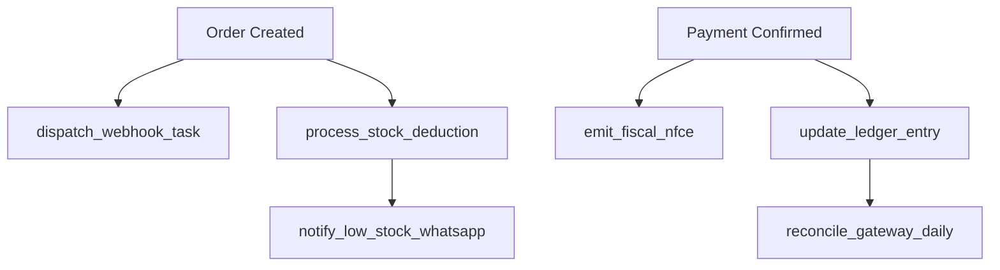

# 🔄 Ciclo de Vida e Dependências: Celery Tasks
**Versão:** 5.0.2-SEQ | **Domínio:** BACKEND | **Status:** MAPPED

## 1. Mapa de Dependências de Tasks

## 2. Gestão de Bloqueios e Deadlocks
- **Task Isolation:** Nenhuma task Celery pode abrir uma transação de banco que dure mais de 2 segundos.
- **Priorização Dinâmica:**
    - `HIGH`: Webhooks de Pagamento, Alertas de Cozinha.
    - `MEDIUM`: Emissão Fiscal, Sincronia de Estoque.
    - `LOW`: Relatórios de BI, Reconciliação de Ledger.

## 3. Retry Inteligente com Backoff Adaptativo
- **Fórmula:** `delay = min(3600, (2 ^ retry_count) + random_jitter)`.
- **Max Retries:** 5 para falhas de rede; 0 para falhas de lógica (DataError).

