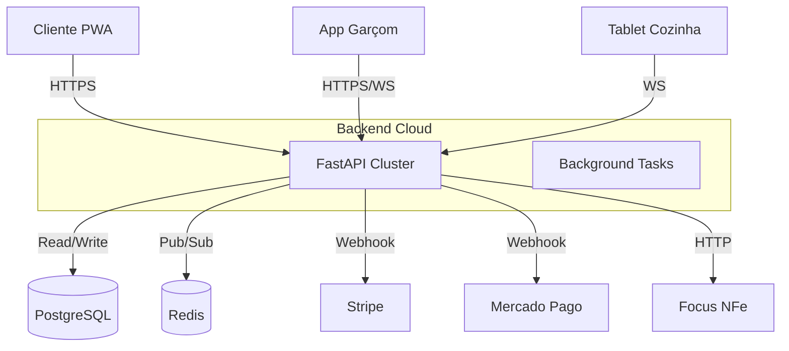

# 🏗️ Software Design Specification (SDS)

> **Sistema:** MesaFlow
> **Arquitetura:** Monolito Modular Híbrido

## 1. Visão Geral da Arquitetura
O sistema é composto por um Backend central (API Gateway + Business Logic), múltiplos Frontends (Web Admin, PWA Cliente) e um App Mobile Nativo.

## 2. Modelo de Dados (ERD Resumido)

### Entidades Core
- **Company:** Tenant raiz. Configurações, chaves de API, branding.
- **User/Employee:** Atores do sistema com roles definidos.
- **Product/Category:** Catálogo de venda.
- **Order/OrderItem:** Transações.

### Entidades de Suporte
- **Table/Session:** Mapeamento físico e sessões temporais de consumo.
- **AuditLog:** Rastreabilidade de segurança.
- **FeatureFlag:** Controle de rollout de funcionalidades.

## 3. Fluxos de Dados Críticos

### 3.1. Fluxo de Pedido Real-Time
1.  **Origem:** Cliente envia `POST /orders`.
2.  **Persistência:** API salva no PostgreSQL.
3.  **Evento:** API publica mensagem `new_order` no canal Redis `mesaflow:{slug}`.
4.  **Distribuição:** Workers assinam o canal e despacham via WebSocket para KDS/Garçom conectados.
5.  **Confirmação:** KDS recebe e toca som.

### 3.2. Fluxo de Sincronização Offline
1.  **Origem:** App Garçom sem rede.
2.  **Persistência Local:** Pedido salvo no `AsyncStorage` / `Dexie.js`.
3.  **Detecção:** Listener de rede detecta `ONLINE`.
4.  **Sincronização:** Loop processa a fila local enviando `POST` para a API.
5.  **Reconciliação:** Backend aceita (Idempotência) e confirma. App limpa fila local.

## 4. Stack Tecnológica Detalhada
- **Linguagem Backend:** Python 3.11 (Type Hints estritos).
- **Framework Web:** FastAPI (Uvicorn/Gunicorn).
- **ORM:** SQLAlchemy 2.0 (Async).
- **Frontend Web:** Next.js 14 (React Server Components).
- **Mobile:** React Native (Expo SDK 54).
- **State Management:** Zustand (Mobile/Web) + React Query.
