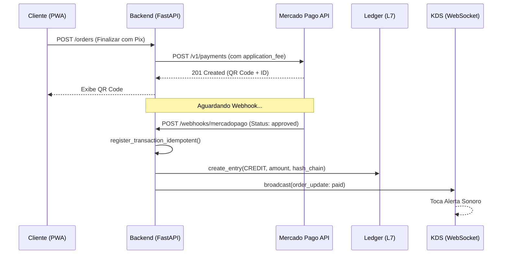
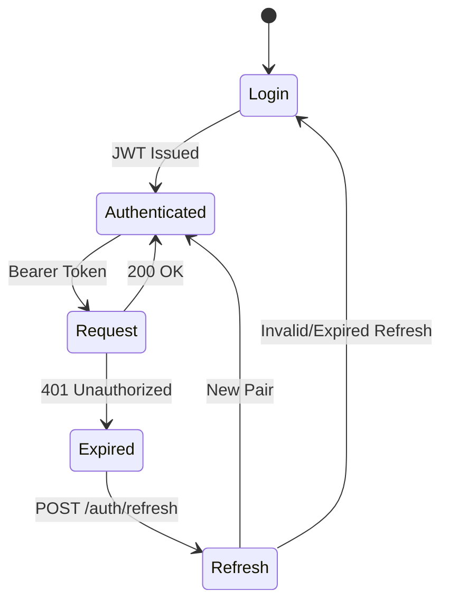

# 📊 Diagramas de Fluxo e Sequência (Mermaid)
**Domínio:** ARCHITECTURE / DOCUMENTATION
**Status:** ATIVO

Este documento centraliza a lógica visual dos processos críticos do MesaFlow OS.

---

## 1. Fluxo de Pagamento Pix (Split Automático)
Este diagrama descreve a interação entre o Cliente, Backend, Mercado Pago e o Ledger Financeiro.



---

## 2. Ingestão de Pedidos iFood (Hub Bridge)
Fluxo de captura de pedidos externos para o monitor de cozinha unificado.

```mermaid
graph TD
    IF[iFood API] -->|Webhook| WH[webhooks_ifood.py]
    WH -->|Verify Signature| HMAC{HMAC-SHA256 OK?}
    HMAC -->|Não| ERR[403 Forbidden]
    HMAC -->|Sim| BG[process_event_background]
    BG -->|Fetch Details| IF
    IF -->> BG: Order JSON
    BG -->|Map Products| DB[(PostgreSQL)]
    BG -->|Broadcast| WS[WebSocket Manager]
    WS -->|Notify| KDS[Monitor de Cozinha]
```

---

## 3. Ciclo de Vida do Token (Auth Hardening)

