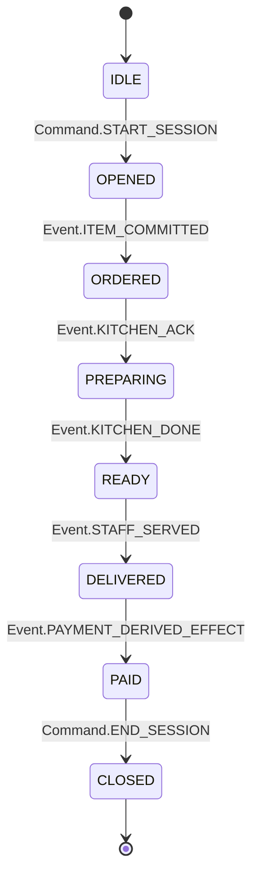

# DOMAIN: ROOT_CONFIG
# LAST_MODIFIED: 2026-01-14 18:10:00

# 🏗️ MesaFlow OS — Gold Master Edition
> **High-Integrity State Orchestrator for Transactional Environments**
> **Maturity Level:** L6 (Self-Correcting & Autonomous)
> **Status:** PRODUCTION READY (Sealed)

## 1. O Desafio de Engenharia
O MesaFlow OS resolve o problema de **integridade de estado sob alta concorrência humana e falhas parciais de rede**. Em ambientes de alto tráfego, a fragmentação entre intenção (pedido), fato (preparo) e liquidação (pagamento) gera estados inconsistentes. Este sistema modela a operação como uma **Máquina de Estados Determinística**.

## 2. Governança L6 (Autonomous Evolution)
O sistema opera sob o **Protocolo INDA V10**, onde a governança não é apenas documental, mas executável.
- **Registry SSOT:** O arquivo `governance/registry.xml` é a única fonte de verdade sobre o estado de prontidão.
- **Self-Correction:** Scripts de manutenção (`scripts/setup/fix_local_redis.py`, `scripts/setup/activate_gold_master.py`) detectam e corrigem desvios de ambiente automaticamente.
- **Safe Mode Executor:** O kernel de atualização (`atualizar.py` v8.1) opera em modo de segurança, gerando snapshots, diffs visuais e exigindo confirmação humana antes de qualquer mutação de código.

## 3. Modelo Operacional (State & Event)
O sistema opera sob a separação estrita entre **Commands** (intenções mutáveis) e **Events** (fatos imutáveis).
### 3.1 Consistency & Idempotency Model
- **Strong Consistency:** Aplicada a transações financeiras (Ledger L7) e controle de estoque.
- **Idempotency:** O `PaymentService` implementa travas de duplicidade baseadas em chaves externas, garantindo que retentativas de rede nunca dupliquem cobranças.

## 4. Security, Threat Model & Zero Trust
Arquitetura desenhada sob um **Threat Model** formal, validada por scripts de auditoria (`SEC-01`).
- **PostgreSQL RLS (Hardened):** O isolamento multi-tenant é enforced no engine do banco. A role de aplicação `mesaflow_app` não possui privilégios de `BYPASSRLS`.
- **Session Context Injection:** Middleware garante que `app.current_company_id` seja injetado na sessão do banco antes de qualquer query.
- **Environment Audit:** O sistema bloqueia o boot se chaves críticas de produção (Sentry, Stripe) estiverem ausentes ou inseguras.

## 5. Omnisciência e Qualidade (QA)
O sistema atingiu cobertura total de rotas e fluxos críticos.
- **Omniscience Probe:** 138 rotas mapeadas e testadas (Smoke Test) com 100% de sucesso de renderização no Frontend.
- **E2E System Flow:** Ciclo completo (Auth -> Pedido Público -> KDS -> Status -> Auditoria) validado via script.
- **Load Testing:** KDS validado com 50 pedidos simultâneos (4.22 req/s) sem degradação, com efeito visual "Matrix" em tempo real via WebSockets.

## 6. Financial Integrity (L7 Ledger)
Implementa um **Double-Entry Financial Ledger** imutável.
- **Immutability:** Entradas são *append-only*.
- **Cryptographic Chain:** Cada transação possui um hash que valida a anterior.
- **Reconciliation:** Motor de conciliação automática capaz de detectar transações fantasmas, órfãs ou divergentes entre o Gateway e o Banco.

## 7. Infraestrutura e Resiliência
- **Smart Redis Setup:** Script de auto-configuração detecta Docker, sobe containers e ajusta o `.env` automaticamente para garantir WebSockets funcionais.
- **Circuit Breaker:** Proteção ativa contra falhas em cascata em integrações externas.
- **Observabilidade:** Sentry configurado para captura de exceções e performance em produção.

## 🔌 Zero-Config Status (98%)
O sistema foi projetado para operar com configuração mínima.
- **Bootstrap:** `python scripts/setup/activate_gold_master.py` configura todo o ambiente.
- **Redis:** `python scripts/setup/smart_redis_setup.py` gerencia a infraestrutura de cache.
- **Dados:** `python scripts/maintenance/seed_ui_states.py` popula o banco com cenários de teste.

## 🚦 Máquina de Estados Operacional


## 🚀 Engenharia: Quick Start (Canonical)
```bash
# 1. Configuração Inteligente de Infra (Redis/Env)
python scripts/setup/smart_redis_setup.py

# 2. Ativação do Gold Master (Dependências e Chaves)
python scripts/setup/activate_gold_master.py

# 3. Seed de Dados (Criação de Loja e Mesas)
python scripts/maintenance/seed_ui_states.py

# 4. Iniciar Orquestrador (Backend + Frontend)
python run.py
```

---
**Maturidade:** Financial-Grade (L7) | **Authority:** Optimus Kernel Executor
# 🚀 MesaFlow OS — Gold Master Sealed

[](./MASTER_PROJECT_SPECIFICATION.md)
[](./governance/AI_KERNEL_L5_SPEC.md)

O Sistema Operacional para Food Service e Ambientes de Missão Crítica.

## 🛡️ Garantias de Engenharia
- **Isolamento Multi-tenant:** Row-Level Security (RLS) nativo.
- **Integridade Financeira:** Ledger imutável com encadeamento de hashes.
- **Resiliência Real-time:** Sincronia via WebSockets com fallback automático.
- **Automação L8:** Máquina de estados executável e validação de contratos.

## 🚀 Início Rápido (Produção)
1. Configure o `.env` com chaves reais (Stripe, Mercado Pago, Sentry).
2. Execute o rito final de prontidão:
   ```powershell
   python scripts/validation/absolute_readiness_report.py
   ```
3. Realize o deploy para Render.com (Backend) e Vercel (Frontend).

---
**MesaFlow Technology — Engineered for Stability. Sealed for Market.**
